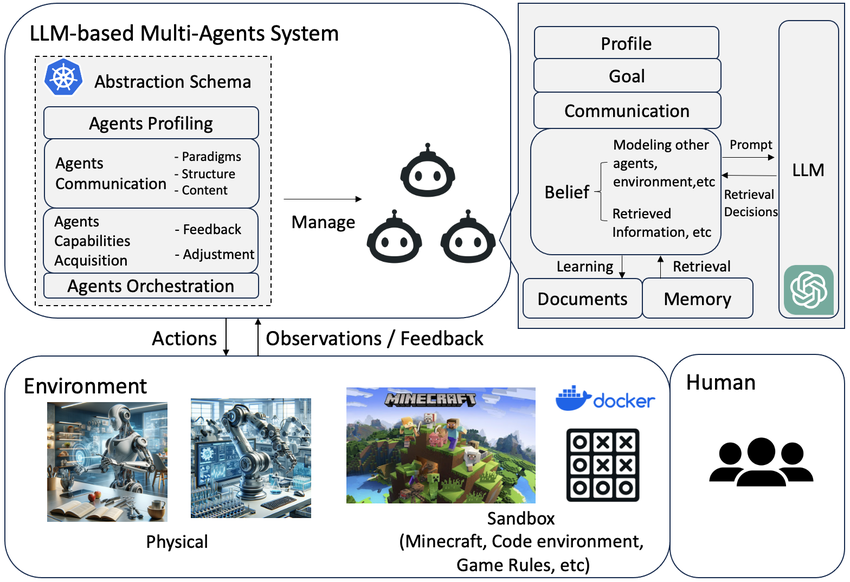
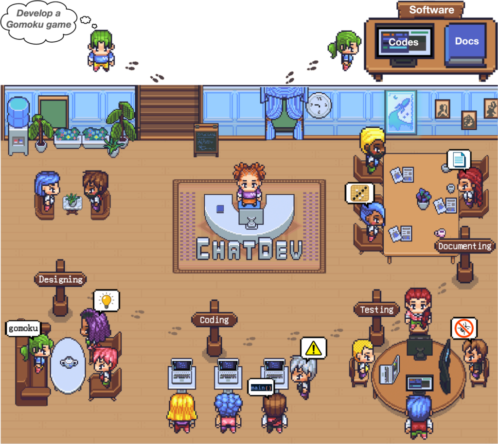
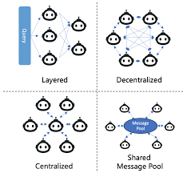

# Large Language Model based Multi-Agents: A Survey of Progress and Challenges

Gần đây, các mô hình ngôn ngữ lớn (LMMs) đang phát triển cực kỳ mạnh me và dần đạt được thành công vang dội trong nhiều nhiệm vụ khác nhau. Với khả năng lập kế hoạch và lập luận ấn tượng, LLM dần được sử dụng như Autonomous Agents, tự động hóa xử lý một số vấn đề và thực hiện các nhiệm vụ tự động. Kèm theo đó trong thời gian gần đây, các hệ thống LLM-based Multi-Agents (Hệ thống đa tác nhân được xây dưng dựa trên LLM) được phát triển và đạt được tiến bộ đáng kể trong việc giải quyết vấn đề phức tạp và mô phỏng. Ở chuỗi bài viết này chúng ta sẽ đi sâu hơn về LLM-based Multi-Agents (LLM-MA), với việc tập trung để làm rõ về các khía cạnh thiết yếú của LLM-based Multi-Agents cũng như các ứng dụng hay thách thức đặt ra, cùng với việc trả lời những câu hỏi sau: 

- Hệ thống đa tác nhân dựa trên LLM mô phỏng những lĩnh vực và môi trường nào? Các tác nhân này được định hình như thế nào và họ giao tiếp như thế nào?
- Cơ chế nào góp phần vào sự phát triển năng lực của các tác nhân?
- Đối với những ai quan tâm đến việc nghiên cứu lĩnh vực này, chúng tôi cũng tóm tắt các tập dữ liệu hoặc điểm chuẩn thường được sử dụng để họ có thể dễ dàng truy cập.
- Để cập nhật cho các nhà nghiên cứu về những nghiên cứu mới nhất, chúng tôi duy trì một kho lưu trữ GitHub nguồn mở, dành riêng để phác thảo nghiên cứu về hệ thống đa tác nhân dựa trên LLM.

Note: Mình viết dựa trên paper Large Language Model based Multi-Agents: A Survey of Progress and Challenges, mọi người có thể tìm đọc thêm tại [đây](https://arxiv.org/abs/2402.01680)

## 1. Kiến trúc hệ thống của LLM-MA

Ở trong phần này thì mình sẽ đi sâu vào kiến trúc của LLM-MA Systems, chủ yếu là cách các hệ thống LLM-MA đưuọc điều chỉnh như thế nào, môi trường hoạt động ra sao và các mục tiêu cho những hoạt động đó. Kiến trúc được các tác giả đề cập với bốn ý chính: 

- The agents-environment interface
- Agent Profiling 
- Agent Communication 
- Agent Capability Acquistion 

### 1.1 The Agents-Enviroment Interface 

Trước khi đi sâu, chúng ta sẽ làm rõ khái niệm Agents-Enviroment Interface: 

- Agent (Tác Nhân): Ta có thể hiểu đơn giản agent là một thực thể có khả nâng tự động thực hiện các hành động nhằm đạt được một số mục tiêu nhất định . 

- Enviroment (Môi trường): Là tất cả những gì xung quanh các agent mà các agent có thể tương tác và bị tương tác. Môi trường sẽ xác đinh các ngữ cảnh và bối cảnh cụ thể mà các hệ thống LMM-MA được triển khai và tương tác. Ví dụ các môi trường này có thể là môi trường phát triển phàn mềm, trò chơi, hay có thể là mô phỏng lĩnh vực cụ thể hơn như là tài chính. 

- Giao diện (Interface): Có thể hiểu là điểm giao giữa tác nhân và môi trường, nơi mà các tương tác được diễn ra. Đây là khu vực mà thông tin được trao đổi tương tác giữa các agent và env, từ đó các agent nhận được dữ liệu từ môi trường và thực hiện các hành động ảnh hưởng đến môi trường. 

Từ các khái niệm rời rạc ở trên, ta có thể mường tượng được rõ ràng hơn: Agent-Enviroment Interface đề cập đến cách thức mà các Agents tương tác và nhận thức với Môi trường. Thông qua những thông tin đó, các Agent sẽ dần hiểu rõ hơn được xung quanh mình, đưa ra quyết định và học hỏi từ kết quả hành động của mình. 

Chúng ta sẽ đi vào ví dụ được đề cập để hiểu rõ hơn. Trong mô phỏng trò chơi Ma Sói, Enviroment ở đây sẽ là khung cảnh của trò chơi, bao gồm các giai đoạn chuyển từ ngày sang đêm, thời gian thảo luận, cơ chế bỏ phiếu, tính năng nhân vật và cá quy tắc thưởng phạt. Các Agents hiện tại sẽ là ma sói, dân làng, nhà tiên tri, ... Các Agents sẽ thực hiện các chức năng, hay là thực hiện các hành động chung như là bỏ phiếu, kiểm tra vai trò, giết người, .. Từ những hành động đó, các agents sẽ nhận được phản hồi từ môi trường, thông báo cho chúng biết về trạng thái hiện tại của trò chơi. Từ đó những thông tin này sẽ giúp các agents điều chỉnh chiến lược của mình theo thời gian, phản ứng lại sự thay đổi của môi trường và tương tác lẫn nhau. 

Agents-Enviroment Interface được chia làm ba loại chính: 

- Sandbox: Môi trường mô phỏng hoặc ảo do con người xây dựng, nơi mà các agents có thể tương tác tự do hươn và thửu nghiệm với các hành động và chiến lược khác nhai. Đơn cử là việc mô phỏng Software Devopment. 

- Physical: Môi trường thế giới thực, nơi các tác nhân tương tác với các thực thể vật lý và tuân theo các quy luật vật lý và giới hạn của thế giới thực. Trong không gian vật lý, các agents thường phải thực hiên các hành động có kết quả vật lý trực tiếp.  Ví dụ, trong các nhiệm vụ như quét sàn, làm bánh mì, đóng gói hàng tạp hóa, và sắp xếp tủ, các tác nhân robot cần thực hiện các hành động liên tục, quan sát môi trường vật lý, và liên tục tinh chỉnh hành động của mình. 

- None: Các trường hợp mà không có môi trường bên ngoài cụ thể và các agents không có tương tác với bất kỳ môi trường nào. Các ứng dụng này thường chủ yếu tập trung và việc giao tiếp giữa các tác nhân và không phụ thuộc vào môi trường bên ngoài. 

### 1.2. Agents Profiling

Trong hệ thống LLM-MA, từng agent trong hê thống sẽ có một vai trò cụ thể. Các Agents được định nghĩa bởi các đặc điểm, hành động và kỹ năng của họ, được điều chỉnh để đạt được các mục tiêu cụ thể. Trong nhiều hệ thống khác nhau, các tác nhân đảm nhận các vai trò riêng biệt, mỗi vai trò các mô tả toàn diện bao gồm các đặc điểm, khả năng, hành vi và rằng buộc. Ví dụ như trong việc phát triển phần mềm, các agent đảm nhiệm các vai trò khác nhau, như là những người quản lý dự án, coder, BA, ...  

Và việc xây dựng profile khá là quan trọng để xác định sự tương tác và hiệu quả của các agent trong các môi trường. Dựa trên phương pháp khởi tạo profile, thì ta chia ra làm ba loại chính: 

- Pre-defined
- Model-Generated 
- Data-Derived 

### 1.3. Agents Communication 

Là phương pháp mà các agents giao tiếp với nhau. Chúng ta phân tích từ ba góc độ: 

- Các mô hình giao tiếp (Communication Paradigms): Các kiểu và phương pháp tương tác giữa các agents 
- Cấu trúc giao tiếp (Communication Structure): Tổ chức và kiến trúc của mạng lưới giao tiếp trong hệ thống đa tác nhân 
- Nội dung giao tiếp (Communication Content): Nội dung giao tiếp được trao đổi giữa các tác nhân 

Chúng ta sẽ đi sâu hơn một chút về từng góc độ. 

#### 1.3.1. Communication Paradigm

Mô hình giao tiếp (Communication Paradigms) trong các hệ thống LLM-MA xác định các cách thức và phương pháp tương tác giữa các tác nhân. Hiện tại, có ba mô hình giao tiếp chính: Hợp tác (Cooperative), Tranh luận (Debate), và Cạnh tranh (Competitive).

- Hợp tác (Cooperative): Các tác nhân hợp tác làm việc cùng nhau để đạt được mục tiêu hoặc mục đích chung. Các tác nhân sẽ trao đổi thông tin, chia sẻ kiến thức và tài nguyên để nâng cao hiệu quả của giải pháp tập thể. Mô hình này khuyến khích sự đồng long và tối ưu hóa hiệu quả nhóm, giúp các tác nhân đạt được mục tiêu chung một các nhanh chóng và hiệu quả. Ví dụ: Trong môi trường phát triển phần mềm, các tác nhân có thể đóng vai trò như các lập trình viên và quản lý dự án, cùng làm việc để phát triển một sản phẩm phần mềm hoàn chỉnh.

- Tranh luận (Debate): Các tác nhân tham gia vào các cuộc tranh luận để trình bày và bảo vệ quan điểm hoặc giải pháp của mình, đồng thời phản biện quan điểm của người khác. Các tác nhân đưa ra các lập luận, dẫn chứng và phản biện để thuyết phục các tác nhân khác về tính đúng đắn của quan điểm hoặc giải pháp của mình. Mô hình này lý tưởng để đạt được sự đồng thuận hoặc giải pháp tinh tế hơn, vì nó cho phép xem xét nhiều góc nhìn và phân tích sâu sắc các vấn đề. Ví dụ: Trong một nền tảng tranh luận, các tác nhân có thể đóng vai trò là người ủng hộ, phản đối hoặc giám khảo, mỗi người trình bày và bảo vệ quan điểm của mình để đạt được sự đồng thuận.

- Cạnh tranh (Competitive): Các tác nhân làm việc hướng tới mục tiêu riêng của họ, có thể mâu thuẫn với mục tiêu của các tác nhân khác. Các tác nhân cạnh tranh để đạt được lợi ích cá nhân hoặc thắng lợi trong một tình huống cụ thể, thường thông qua việc tối ưu hóa chiến lược của mình và phản ứng lại các hành động của tác nhân khác. Mô hình này thúc đẩy sự phát triển của các chiến lược sáng tạo và tối ưu hóa, đồng thời tạo ra một môi trường động và thử thách. Ví dụ: Trong các trò chơi chiến lược, các tác nhân đóng vai trò là người chơi với mục tiêu riêng, cố gắng đánh bại đối thủ và giành chiến thắng.

#### 1.3.2. Communication Structure 

Cấu trúc giao tiếp (Communication Structure) trong các hệ thống LLM-MA là cách thức tổ chức và sắp xếp mạng lưới giao tiếp giữa các tác nhân. Có bốn loại bốn cấu trúc điển hình: 

- Giao tiếp phân lớp (Layered Communication): Được cấu trúc theo thứ bậc, với các tác nhân ở mỗi cấp độ có vai trò riêng biệt và chủ yếu tương tác trong lớp của họ hoặc với các lớp liền kề. Ví dụ: [Liu et al., 2023] giới thiệu khung Mạng tác nhân LLM động (DyLAN), tổ chức các tác nhân trong một mạng lưới nhiều lớp tiến bộ. Cấu hình này tạo điều kiện cho các tương tác động, tích hợp các tính năng như lựa chọn tác nhân tại thời gian suy luận và cơ chế dừng sớm, tổng thể cải thiện hiệu quả hợp tác giữa các tác nhân.

- Giao tiếp phi tập trung (Decentralized Communication): Hoạt động trên mạng ngang hàng (peer-to-peer), nơi các tác nhân trực tiếp giao tiếp với nhau. Thường được sử dụng trong các ứng dụng mô phỏng thế giới, cấu trúc này cho phép các tác nhân có sự tự do cao trong tương tác và trao đổi thông tin, không phụ thuộc vào bất kỳ tác nhân trung tâm nào.

- Giao tiếp tập trung (Centralized Communication): Có một tác nhân trung tâm hoặc một nhóm tác nhân trung tâm điều phối giao tiếp của hệ thống. Các tác nhân khác chủ yếu tương tác thông qua nút trung tâm này.Ưu điểm của kiến trúc này là dễ dàng quản lý và kiểm soát thông tin, đảm bảo tính nhất quán trong giao tiếp và có thể tối ưu hóa hiệu quả trao đổi thông tin thông qua tác nhân trung tâm.

- Bể thông điệp chia sẻ (Shared Message Pool): MetaGPT [Hong et al., 2023] đề xuất cấu trúc này để cải thiện hiệu quả giao tiếp. Cấu trúc này duy trì một bể thông điệp chung, nơi các tác nhân đăng thông điệp và đăng ký các thông điệp liên quan dựa trên hồ sơ của họ. Điểm mạnh là Tăng cường hiệu quả giao tiếp bằng cách cho phép các tác nhân dễ dàng truy cập và chia sẻ thông tin liên quan, giảm thiểu sự lặp lại và đảm bảo rằng các thông điệp quan trọng không bị bỏ sót.

#### 1.3.3. Communication Content

Nội dung giao tiếp trong các hệ thống LLM-MA thường dưới dạng văn bản (text). Nội dung cụ thể thay đổi rộng rãi và phụ thuộc vào ứng dụng cụ thể. Dưới đây là một số ví dụ:

- Phát triển phần mềm: Các tác nhân có thể giao tiếp với nhau về các đoạn mã, bug, tính năng mới, hoặc các vấn đề cần giải quyết.
- Mô phỏng trò chơi: Trong các trò chơi như Ma Sói, các tác nhân có thể thảo luận về phân tích của mình, nghi ngờ hoặc chiến lược.
- Thị trường tài chính: Các tác nhân có thể trao đổi thông tin về dự đoán thị trường, phân tích dữ liệu kinh tế, hoặc các quyết định đầu tư.
- Mô hình hành vi xã hội: Các tác nhân có thể giao tiếp về hành vi, cảm xúc, hoặc các tương tác xã hội để mô phỏng các tình huống xã hội phức tạp.

### 1.4. Agents Capabilitties Acquisition 

Agents Capabilities Acquisition là qúa trình mà trong đó các tác nhân (agents) học hỏi, phát triển và điều chỉnh các hành động của mình. Qúa trình này được chia ra làm hai khái niệm chính: Từ các phản hồi (feedback) các tác nhân học hỏi để nâng cao khả năng của mình và các chiến lược để các tác nhân tự điều chỉnh nhằm giải quyết hiệu quả các vấn đề phức tạp. 

#### 1.4.1. Feedback

Từ các phản hồi thường chứa những thông tin quan trong về kết quả của các hành động của các tác nhân, các tác nhân sẽ lấu đó làm cơ sở để giúp họ học hỏi và giải quyết các vấn đề phức tạp. Có bốn loại phản hồi chính (dựa trên nguồn gốc của các loại phản hồi): 

- Phản hồi từ môi trường: Tác nhân nhận phản hồi từ các môi trường thực tế hoặc ảo. Ví dụ, trong phát triển phần mềm, tác nhân nhận phản hồi từ trình thông dịch mã. Trong hệ thống tác nhân hiện hữu, robot nhận phản hồi từ môi trường thực hoặc môi trường mô phỏng.

- Phản hồi từ tương tác giữa các tác nhân: Phản hồi này đến từ phán xét của các tác nhân khác hoặc từ các cuộc giao tiếp giữa chúng. Điều này phổ biến trong các kịch bản giải quyết vấn đề như tranh luận khoa học, nơi các tác nhân học cách đánh giá và tinh chỉnh kết luận thông qua giao tiếp.

- Phản hồi từ con người: Phản hồi trực tiếp từ con người, quan trọng để căn chỉnh hệ thống đa tác nhân với các giá trị và sở thích của con người. Loại phản hồi này được sử dụng rộng rãi trong các ứng dụng "Human-in-the-loop".

- Không có phản hồi: Trong một số trường hợp, không có phản hồi được cung cấp cho các tác nhân, thường xảy ra trong các công trình mô phỏng thế giới tập trung vào phân tích kết quả mô phỏng thay vì khả năng lập kế hoạch của các tác nhân.

#### 1.4.2. Agents Adjustment to Complex Problems

Để nâng cao khả năng, các tác nhân trong hệ thống LLM-MA có thể thích nghi thông qua ba giải pháp chính:

- Bộ nhớ (Memory): Nhiều hệ thống LLM-MA sử dụng một mô-đun bộ nhớ để các tác nhân điều chỉnh hành vi của mình. Tác nhân lưu trữ thông tin từ các tương tác và phản hồi trước đó trong bộ nhớ. Khi thực hiện hành động, họ có thể truy xuất những ký ức có giá trị, đặc biệt là những hành động thành công trong các mục tiêu tương tự trong quá khứ.

- Tự tiến hóa (Self-Evolution): Thay vì chỉ dựa vào hồ sơ lịch sử để quyết định hành động tiếp theo như trong các giải pháp dựa trên bộ nhớ, các tác nhân có thể tự tiến hóa động bằng cách thay đổi các mục tiêu ban đầu và chiến lược lập kế hoạch, và tự đào tạo dựa trên phản hồi hoặc nhật ký giao tiếp. Ví dụ, các tác nhân có thể sử dụng các nhật ký giao tiếp để tạo ra các tập dữ liệu để đào tạo hoặc tinh chỉnh các mô hình ngôn ngữ lớn (LLMs).

- Tạo động (Dynamic Generation): Trong một số kịch bản, hệ thống có thể tạo ra các tác nhân mới ngay trong quá trình hoạt động. Khả năng này giúp hệ thống mở rộng và thích nghi hiệu quả, khi có thể giới thiệu các tác nhân được thiết kế đặc biệt để giải quyết các nhu cầu và thách thức hiện tại.

## 2. Applications

### 2.1. LLM-MA for Problem Solving

#### 2.1.1. Software Development

Phát triển phần mềm là một công việc phức tạp đòi hỏi sự hợp tác của nhiều vai trò như quản lý sản phẩm, lập trình viên và tester. Các hệ thống LLM-MA thường mô phỏng các vai trò riêng biệt này và hợp tác để giải quyết các thách thức phức tạp. Theo quy trình phát triển phần mềm waterfall hoặc các Quy trình Hoạt động Chuẩn (SOPs), cấu trúc giao tiếp giữa các tác nhân thường được xếp lớp. Các tác nhân thường tương tác với trình thông dịch mã, các tác nhân khác hoặc con người để tinh chỉnh mã được tạo ra.

#### 2.1.2. Embodied Agents

Embodied Agents là các hệ thống robot tiên tiến có khả năng tương tác với môi trường vật lý thông qua các nhiệm vụ phức tạp. Các ứng dụng của embodied agents thường yêu cầu nhiều robot làm việc cùng nhau, tận dụng các khả năng khác nhau của từng robot để hoàn thành các nhiệm vụ như quản lý kho. Sự phát triển của các mô hình ngôn ngữ lớn (LLM) đã mở ra khả năng mới cho việc lập kế hoạch và phối hợp hành động giữa các robot này. Các nghiên cứu gần đây, chẳng hạn như RoCo và CoELA, đã minh chứng cho khả năng của LLM trong việc cải thiện giao tiếp và lập kế hoạch đường đi, đồng thời giải quyết các thách thức liên quan đến điều khiển phi tập trung và giao tiếp trong các hệ thống đa robot. Những tiến bộ này hứa hẹn nâng cao hiệu quả và khả năng ứng dụng của các hệ thống robot trong các nhiệm vụ thực tế phức tạp.

#### 2.1.3. Science Experiments

#### 2.1.4. Science Debate 

### 2.2.  LLM-MA for World Simulation

#### 2.2.1. Sicietal Simulation 

#### 2.2.2. Gaming

#### 2.2.3. Psychology

#### 2.2.4. Economy

#### 2.2.5. Recommender System 

#### 2.2.6. Policy Making 

#### 2.2.7. Disease Propagation Simulation

## 3. Challenges and Opportunities 

### 3.1. Advancing into Multi-Modal Environment

Tương tác hiện tại của các tác nhân với nhau chủ yếu là text. Lịch sử cho thấy, các hệ thống LLM-MA đã xuất sắc trong việc xử lý và tạo ra văn bản, nhưng lại gặp hạn chế đáng kể khi đối mặt với các thiết lập đa phương thức. Môi trường đa phương thức tích hợp nhiều dạng dữ liệu khác nhau như hình ảnh, âm thanh, video, và thậm chí là các hành động vật lý. Sự tích hợp này đặt ra những thách thức đặc biệt như việc xử lý các loại dữ liệu đa dạng và đảm bảo sự giao tiếp liền mạch giữa các tác nhân vượt ra ngoài thông tin văn bản.

Để tiến bộ trong các môi trường này, LLM cần phát triển khả năng giải thích và tương tác với nhiều đầu vào cảm giác, cho phép chúng tạo ra các đầu ra toàn diện và phù hợp với ngữ cảnh. Tiến bộ này là rất cần thiết để tăng cường tính thích ứng và hiệu quả của các hệ thống LLM-MA trong nhiều ứng dụng rộng rãi hơn, từ trợ lý ảo tương tác đến robot tự động, làm cho chúng trở nên đa năng và phù hợp hơn với sự phức tạp của thế giới thực.

### 3.2. Addressing Hallucination

Vấn đề hallucination (ảo giác) là một thách thức lớn trong các mô hình ngôn ngữ lớn (LLMs) và hệ thống dựa trên một tác nhân duy nhất. Hallucination đề cập đến hiện tượng khi mô hình tạo ra văn bản không đúng sự thật. Tuy nhiên, vấn đề này trở nên phức tạp hơn trong bối cảnh đa tác nhân (multi-agent). Trong các tình huống này, hallucination từ một tác nhân có thể gây ra hiệu ứng dây chuyền. Điều này là do tính chất kết nối của các hệ thống đa tác nhân, nơi mà thông tin sai lệch từ một tác nhân có thể được chấp nhận và lan truyền thêm bởi các tác nhân khác trong mạng lưới.

Do đó, việc phát hiện và giảm thiểu hallucination trong LLM-MA không chỉ là một nhiệm vụ quan trọng mà còn đặt ra một loạt thách thức đặc thù. Nó đòi hỏi không chỉ việc sửa chữa các thông tin sai lệch ở mức độ của từng tác nhân mà còn phải quản lý dòng thông tin giữa các tác nhân để ngăn chặn sự lan truyền của những thông tin không chính xác này trong toàn hệ thống.

### 3.3. Acquiring Collective Intelligence

Trong các hệ thống đa tác nhân truyền thống, các tác nhân thường sử dụng học tăng cường (reinforcement learning) để học từ các tập dữ liệu đào tạo ngoại tuyến. Tuy nhiên, các hệ thống LLM-MA (Mô hình ngôn ngữ lớn - Hệ thống đa tác nhân) chủ yếu học từ phản hồi tức thì, chẳng hạn như tương tác với môi trường hoặc con người, như đã thảo luận ở Phần 3. Phong cách học này đòi hỏi một môi trường tương tác đáng tin cậy và việc thiết kế môi trường tương tác như vậy cho nhiều nhiệm vụ có thể rất phức tạp, hạn chế khả năng mở rộng của các hệ thống LLM-MA.

Hơn nữa, các phương pháp phổ biến trong nghiên cứu hiện nay liên quan đến việc sử dụng các kỹ thuật Bộ Nhớ (Memory) và Tự Tiến Hóa (Self-Evolution) để điều chỉnh các tác nhân dựa trên phản hồi. Mặc dù hiệu quả đối với từng tác nhân riêng lẻ, nhưng những phương pháp này không hoàn toàn tận dụng được tiềm năng trí tuệ tập thể của mạng lưới tác nhân. Chúng điều chỉnh các tác nhân một cách riêng lẻ, bỏ qua các hiệu ứng cộng hưởng có thể xuất hiện từ sự phối hợp tương tác giữa các tác nhân. Do đó, việc điều chỉnh đồng thời nhiều tác nhân và đạt được trí tuệ tập thể tối ưu vẫn là một thách thức quan trọng đối với các hệ thống LLM-MA.

### 3.4. Scaling Up LLM-MA Systems

Hệ thống LLM-MA được cấu thành từ nhiều tác nhân dựa trên các mô hình ngôn ngữ lớn (LLM), đặt ra thách thức đáng kể về khả năng mở rộng liên quan đến số lượng tác nhân. Từ góc độ phức tạp tính toán, mỗi tác nhân dựa trên LLM, thường được xây dựng trên các mô hình ngôn ngữ lớn như GPT-4, đòi hỏi nguồn tài nguyên tính toán và bộ nhớ đáng kể. Việc mở rộng số lượng các tác nhân này trong một hệ thống LLM-MA sẽ tăng mạnh yêu cầu về tài nguyên. Trong các kịch bản có nguồn lực tính toán hạn chế, phát triển các hệ thống LLM-MA này sẽ gặp nhiều thách thức.

Ngoài ra, khi số lượng tác nhân trong một hệ thống LLM-MA tăng lên, các phức tạp và cơ hội nghiên cứu bổ sung sẽ xuất hiện, đặc biệt là trong các lĩnh vực như phối hợp tác nhân hiệu quả, giao tiếp và hiểu các quy luật mở rộng của hệ thống đa tác nhân. Chẳng hạn, với số lượng tác nhân LLM lớn hơn, độ phức tạp của việc đảm bảo sự phối hợp và giao tiếp hiệu quả tăng lên đáng kể. Như đã được nhấn mạnh trong nghiên cứu của [Dibia, 2023], việc thiết kế các phương pháp điều phối tác nhân tiên tiến ngày càng trở nên quan trọng. Các phương pháp này nhằm tối ưu hóa luồng công việc của các tác nhân, phân công nhiệm vụ phù hợp với các tác nhân khác nhau và các mô hình giao tiếp giữa các tác nhân như các ràng buộc giao tiếp giữa các tác nhân. Điều phối tác nhân hiệu quả giúp hoạt động của các tác nhân hài hòa, giảm thiểu xung đột và dư thừa. Ngoài ra, việc khám phá và định nghĩa các quy luật mở rộng chi phối hành vi và hiệu quả của các hệ thống đa tác nhân khi chúng phát triển lớn hơn vẫn là một lĩnh vực nghiên cứu quan trọng. Những khía cạnh này nhấn mạnh sự cần thiết của các giải pháp sáng tạo để tối ưu hóa các hệ thống LLM-MA, làm cho chúng vừa hiệu quả vừa tiết kiệm tài nguyên.

### 3.5. Evaluation and Benchmarks

Hai thách thức chính: 

- Phần lớn nghiên cứu hiện tại tập trung vào việc đánh giá sự hiểu biết và lý luận của từng tác nhân trong các kịch bản hẹp. Sự tập trung này thường bỏ qua các hành vi phức tạp và rộng hơn, vốn là phần cốt lõi của các hệ thống đa tác nhân. 
- Có sự thiếu hụt đáng kể trong việc phát triển các tiêu chuẩn toàn diện cho nhiều lĩnh vực nghiên cứu khác nhau như Science Experiments, Economic analysis hay là  Disease propagation simulation. Đây là trở ngại để đánh giá chính xác và so sánh năng lực đầy đủ của các hệ thống LLM-MA trong các lĩnh vực quan trọng và đa dạng này.

### 3.6. Applications and Beyond

Tiềm năng của các hệ thống LLM-MA vượt xa các ứng dụng hiện tại, mang lại hứa hẹn lớn cho việc giải quyết các vấn đề tính toán nâng cao trong các lĩnh vực như finance, education, healthcare, environmental science, urban planning và nhiều lĩnh vực khác. Như đã thảo luận, các hệ thống LLM-MA có khả năng giải quyết các vấn đề phức tạp và mô phỏng nhiều khía cạnh của thế giới thực. Mặc dù khả năng đóng vai hiện tại của LLM còn có những hạn chế, những tiến bộ đang diễn ra trong công nghệ LLM gợi mở về một tương lai tươi sáng. Dự kiến sẽ có các phương pháp, ứng dụng, bộ dữ liệu và tiêu chuẩn tiên tiến hơn được thiết kế phù hợp cho nhiều lĩnh vực nghiên cứu khác nhau. Hơn nữa, có những cơ hội để khám phá các hệ thống LLM-MA từ các góc độ lý thuyết khác nhau, chẳng hạn như Khoa học Nhận thức, Trí tuệ Nhân tạo Ký hiệu, Điều khiển học, Hệ thống Phức hợp, và Trí tuệ Tập thể. Cách tiếp cận đa chiều này có thể đóng góp vào việc hiểu biết toàn diện hơn và tạo ra các ứng dụng sáng tạo trong lĩnh vực đang phát triển nhanh chóng này.
